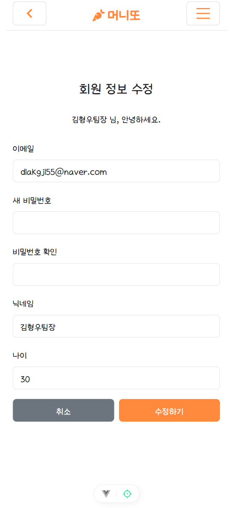
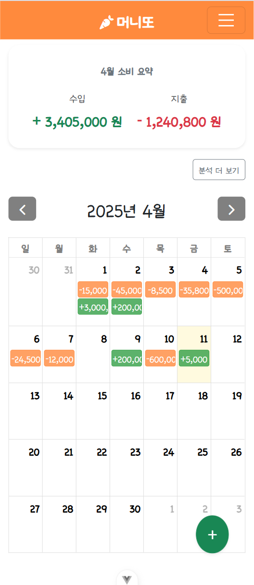
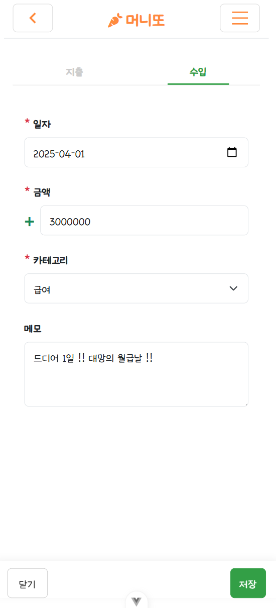
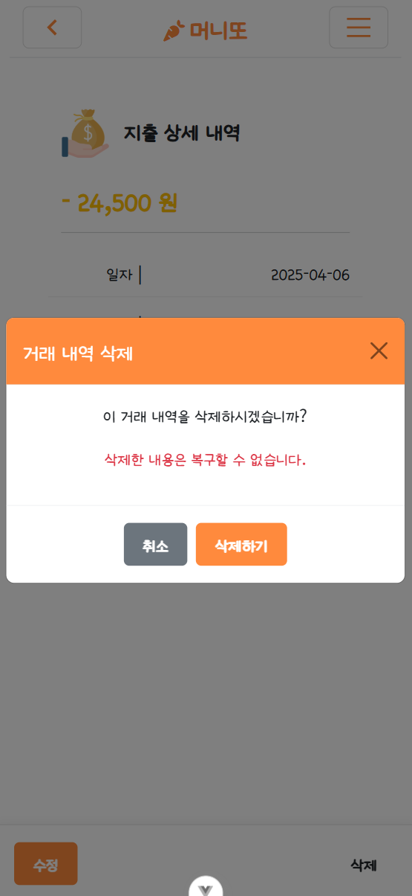
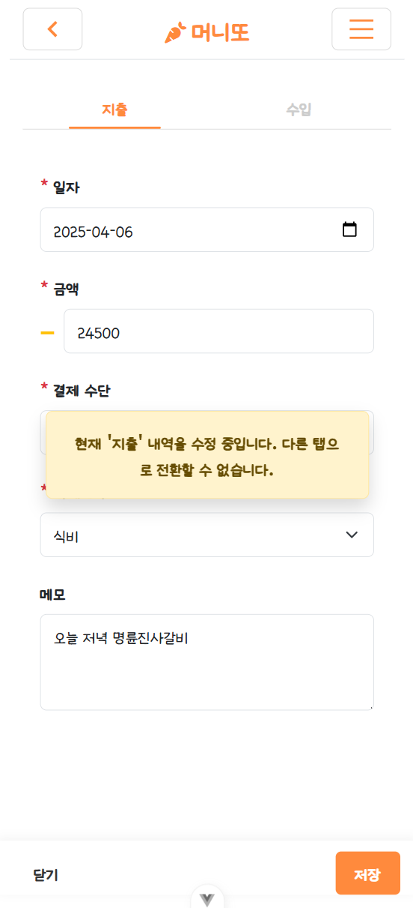
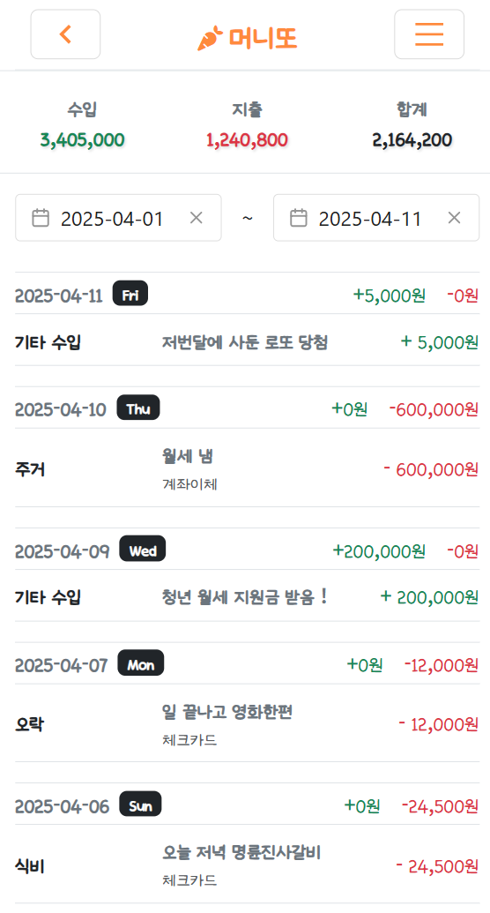
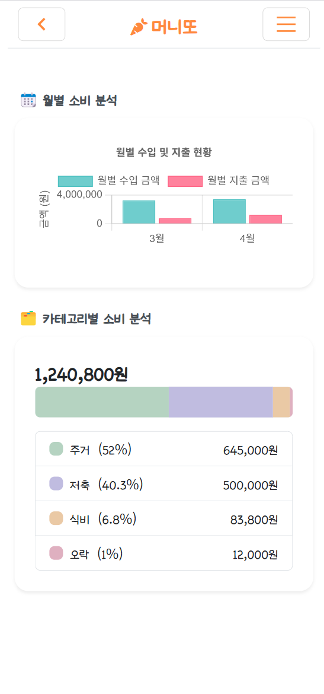

# 💸 MONEY-TTO (머니또)

> **"머니또(Money-tto)"** 는 마니또처럼 사용자의 수입과 지출을 손쉽게 관리하며 통계를 통해 소비 습관을 파악할 수 있도록 도와줍니다.

---

## 📌 기획 의도

### **문제 인식**

- 수기로 가계부를 작성하거나 복잡한 엑셀을 사용하는 것이 불편함.

### **해결 목표**

- 간단하고 직관적인 UI로 수입과 지출을 달력에 기록하고, 통계로 확인할 수 있는 개인 맞춤형 가계부 제공.

---

## ✨ 주요 기능

| 기능              | 설명                                    |
| ----------------- | --------------------------------------- |
| 회원가입 / 로그인 | 이메일, 비밀번호를 활용한 사용자 인증   |
| 수입/지출 등록    | 금액, 날짜, 항목을 입력하여 달력에 표시 |
| 캘린더 뷰         | 월별 보기에서 수입/지출 내역 확인       |
| 통계 차트         | 월별 소비 비율, 항목별 합계 시각화      |
| 카테고리 분석     | 항목별 소비 내역을 분석하고 시각화      |

---

## 🖼 UI 설계

### 로그인 및 회원가입

<div style="display: flex; justify-content: space-around; align-items: center;">
  
  
</div>

### 프로필 수정

<div style="display: flex; justify-content: space-around; align-items: center;">
  
</div>

### 메인 화면

<div style="display: flex; justify-content: space-around; align-items: center;">
  
  
</div>

### 거래 내역 관리

<p align="center">
  
  
  
  
</p>

### 월별 거래 분석 조회

<div style="display: flex; justify-content: space-around; align-items: center;">
  
</div>

---

## 🧩 컴포넌트 구조

```bash
components/
├── CalendarView.vue      # 달력 UI
├── ChartView.vue         # 차트 통계
├── LoginForm.vue         # 로그인 폼
└── Header.vue            # 상단 네비게이션 바
└── Loading.vue           # 로딩 컴포넌트
└── MonthlyAnalysis.vue   # 월 별 분석 차트
└── CategoryAnalysis.vue  # 카테고리 별 차트

```
